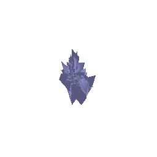

# CMSC848F - Assignment 1: Single View to 3D
## Authors

|Name|ID|Email|
|:---:|:---:|:---:|
|Shantanu Parab|119347539|sparab@umd.edu|

## Description

This package consist of the code and results for the assignment submission for CMSC848F.

**Open [writeup](/report/writeup.md.html) in a browser to access the writeup webpage.**

Extract the dataset from [here](https://drive.google.com/file/d/1VoSmRA9KIwaH56iluUuBEBwCbbq3x7Xt/view) and move it inot the `data` folder. 

# Setup 
- These instruction assume that you have completed all the installation and setup steps requrired.
- To recreate the results in this assignment, download the package and unzip into a folder.
- Move into the package `assignment2_sparab`.

The checkpoints for the model training are not included as they requires more storage space. However these can be downloaded form [here](https://drive.google.com/drive/folders/1AejaPltGvKfmeAvkdCUnqNVx90suKKV9?usp=share_link)

---

# Exploring Loss Functions

- In this section we will define loss functions for fitting voxels,point clouds and meshes.

## Fitting a voxel grid

We use the Binary Cross Entropy Loss for the Voxel Grid. For this we use the `BCEwithLogitsLoss` from `Pytorch`

- **Result:** `images/voxel_render.gif`

**Command:**
`python -m code.fit_data --type 'vox'`

## Fitting a point cloud
We compute `Chamfer Loss` which is the difference between the corresponding predicted and groung truth points.
We use `knn_points` and `knn_gather` to compute the loss.

- **Result:** `images/point_render.gif`

**Command:**
`python -m code.fit_data --type 'point'`

## Fitting a mesh
Here we compute the smoothning loss for the mesh. This is computed using the pre-defined 
`Pytorch` function `mesh_laplacian_smoothing`.

- **Result:** `images/mesh_render.gif`

**Command:**
`python -m code.fit_data --type 'mesh'`

# Reconstructing 3D from a single view

## Image to Voxel Grid

- We will be using the exisiting `ImplicitMLPDecoder`.
- We tune the `batch_size` hyperparameter to get improvization.
- We increase the number of workers to 12 to speed the process of training.
- The comparisons are shown in the end.

- **Result:** `/images/vox_prediction_batch4_instance4.gif`

**Command 1:**
`python -m code.train_model --type 'vox' batch_size 4`

`python -m code.eval_model --type 'vox' --batch 4 --instance 5 --load_checkpoint`

##  Image to Point Cloud
- We will be using a custom decoder with similar architecture as suggested.
- We tune the `batch_size` hyperparameter to get improvization.
- We increase the number of workers to 12 to speed the process of training.
- The comparisons are shown in the end.

- **Result:** `/images/point_prediction_batch16_instance5.gif`

**Command:**
`python -m code.train_model --type 'point' batch_size 16`

`python -m code.eval_model --type 'point' --batch 16 --instance 5 --load_checkpoint`

## Image to Mesh
- We will be using a custom decoder with similar architecture as suggested.
- We tune the `batch_size` hyperparameter to get improvization.
- We increase the number of workers to 12 to speed the process of training.
- The comparisons are shown in the end.

- **Result:** `/images/mesh_prediction_batch16_instance5.gif`

**Command:**
`python -m code.train_model --type 'mesh' batch_size 16`

`python -m code.eval_model --type 'mesh' --batch 16 --instance 5 --load_checkpoint`
## Quantitative Comparisons

The F1 score, also known as the F-score, serves as a robust metric for evaluating the quality of a reconstruction. It operates on point data and computes the harmonic mean between precision and recall. Precision reflects the accuracy of the reconstruction, while recall measures the completeness of the reconstruction.

In the case of voxel representation for 3D objects, the approach involves predicting the likelihood of each voxel grid element being inside the given shape, with '1' indicating inclusion and '0' indicating exclusion. When larger voxel sizes are employed, as demonstrated, it becomes more challenging to capture finer details like the thinner parts of objects, such as the chair's arms or legs. This results in a loss of significant data during the representation process, leading to incomplete reconstructions. Consequently, the recall is lower, which ultimately results in a lower F1 score.

In contrast, the other two methods do not encounter this issue and, therefore, achieve a higher F1 score as they are better equipped to capture intricate details without substantial data loss.

## Analyse Effects of hyperparameter variations

During the hyperparameter analysis, we've specifically examined the impact of the batch_size parameter on training. It was noticeable that a larger batch size led to improved convergence. An illustrative example is the image we used, which doesn't depict a typical four-legged chair but rather a single-legged one.

When the batch size was set to 4, the output didn't converge satisfactorily, and the model still produced results resembling a four-legged chair. However, increasing the batch size resulted in better convergence, aligning the output with the correct shape of the single-legged chair.

It's important to note that increasing the batch size can significantly impact the training speed. The larger the batch size, the longer it typically takes to complete each training iteration. Additionally, accommodating a larger batch size may require reducing the number of workers involved in parallel processing to ensure the efficient allocation of computational resources. 

**Point**

**Mesh**

## Interpret your Model

To gain insights into the learning process of the model, we plan to visualize the predictions at regular intervals, specifically every 1000 iterations. While we are aware that the model converges effectively over the course of 10,000 iterations, taking a closer look at the model's performance at these periodic checkpoints will allow us to analyze the evolution of the model over time. This will provide a detailed understanding of how the model refines its predictions as it progresses through the training process.

As we observe the visualizations, whether they represent points, voxels, or the mesh, we notice that at the initial stages, they appear as a large, uniform, spherical blob. However, with each iteration, they gradually transform and take on a more defined shape. This evolution continues iteratively until the model converges, resulting in the generation of the final 3D model.

Towards the end of the training process, there might still be some points or elements that have not completely converged, indicating that the model hasn't fully refined its predictions for these specific areas. In such cases, it can be inferred that further iterations have the potential to allow these remaining points to converge, resulting in an even more accurate and detailed 3D model.

**Point**

**Mesh**

## Note 

Voxel training is a time-consuming process, which limits the extent of analysis that can be performed with voxels. This is primarily due to the substantial memory requirements associated with voxels. Training on larger batch sizes becomes challenging because it often exceeds the limitations of available GPU memory.

